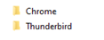
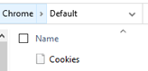

>>>
1. What is the domain of the local network?

flag: PASCALPIG
>>>
2. What is the name of the Domain Controller?

flag: pascalpig-dc
>>>
3. What was the computer name of the client that got infected?

flag: DESKTOP-M1JC4XX
>>>
4. What is the sha1 hash of the downloaded executable?

flag: 1e4b7d7868d25071db67da87392fd5dafab344a9fa6dc040f7afb0699152fc13
>>>
5. What IP was this downloaded from?

flag: 198.12.66.108
>>>
6. This executable is malicious, what is the name of the malware given to it by AegisLab?

flag: Trojan.MSIL.Agensla.i!c
>>>
7. What is the Digicert Thumbprint of the Executable?

flag: 3BA63A6E4841355772DEBEF9CDCF4D5AF353A297
>>>
8. What is the Pastebin like domain that was contacted? (subdomain.domain.tld)

flag: paste.nrecom.net
>>>
9. Data was being exfiltrated from the network. What Protocol was being used?

flag: SMTP
>>>
10. What user account was compromised?

flag: ronaldo.paccione
>>>
11. what email was the exfiltrated data being sent to?

flag: joj@big3.icu
>>>
12. What password was used to send the data?

flag: 5ySP+R071(){#DV9Iu
>>>
13. How may emails were sent out of the network to jojo@big3.icu?

flag: 5
>>>
14. In the emails that were exfiltrated, there was a file that contained passwords. What was the password for ronaldo.paccione@outlook.com?

flag: P@ssw0rd987654e21$
>>>
15. There were some screenshots taken from the computer also. What is the desktop a picture of?

flag: spiderweb
Pick either of the SC_ files and base64 decode and open the jfif file.
>>>
16. The Trojan also captured keystrokes. What was the password for AOL?

flag: dkk3jjfh5hjkd!!!!!
>>>
17. We know that PW_ was for passwords; SC_ was for screenshots; KL_ was for a keylogger. What does the CO_ file represent?

You b64 decode the CO_file to find a .zip

flag: cookies
>>>