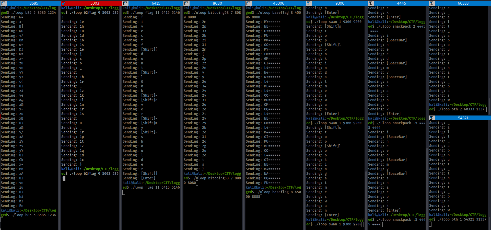
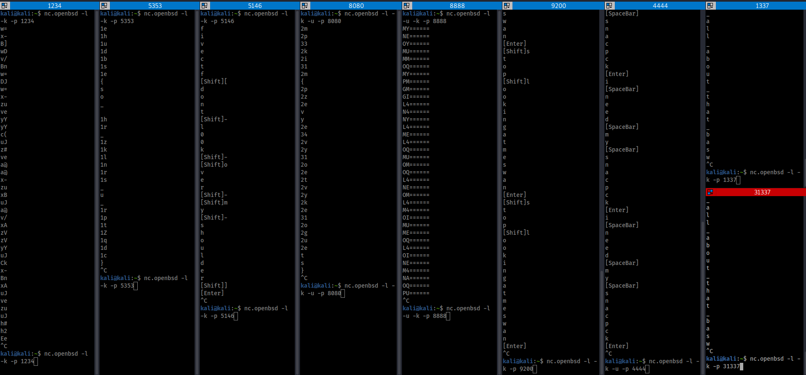

Creation of pcap:

Sender



Reciever



loop.txt

```
#!/bin/bash
FILE=$1
sleep=$2
ip="192.168.56.104"
lp=$3
rp=$4
while read LINE; do
     echo "Sending: $LINE";
     echo $LINE | nc $ip $rp -p $lp -w1;  
     sleep $sleep;
done < $FILE
```

script that recreates new nc session for each line in a file

```
flag						Encryption	listen port	send port	TCP/UDP
fivectf{is_58_worth_more_than_32}		bitcoin58	8080		8080		UDP
fivectf{finally_passing_school_with_an_85}	base85		1234		8585		TCP
fivectf{dont_l00k_Over_My_shoulder}		none		5146		6415		TCP
fivectf{32_on_a_test_is_great_right}		base32		8888		45006		UDP
fivectf{62_is_almost_8_squared}			base62		5353		5003		TCP
```

There are also other unencrypted text being sent and the hint is the one that says we are all about that basw (misspelling oopsie)

CTF challenger must decode each line individually to properly decode the message.
