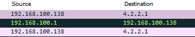
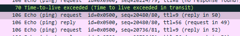
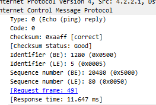

`What is the source IP address?`

`What is the destination IP address?`

`How many hops does it take to get a reply from the destination IP?`

`What is the MAC address of the source?`

`Where is the company that made the the source headquartered? (country)`

`In which packet number do we get the first reply from the destination IP?`

`What was the response time? Answer in 3 digit percision`

`What is the IP address of the 5th router in the path?`
